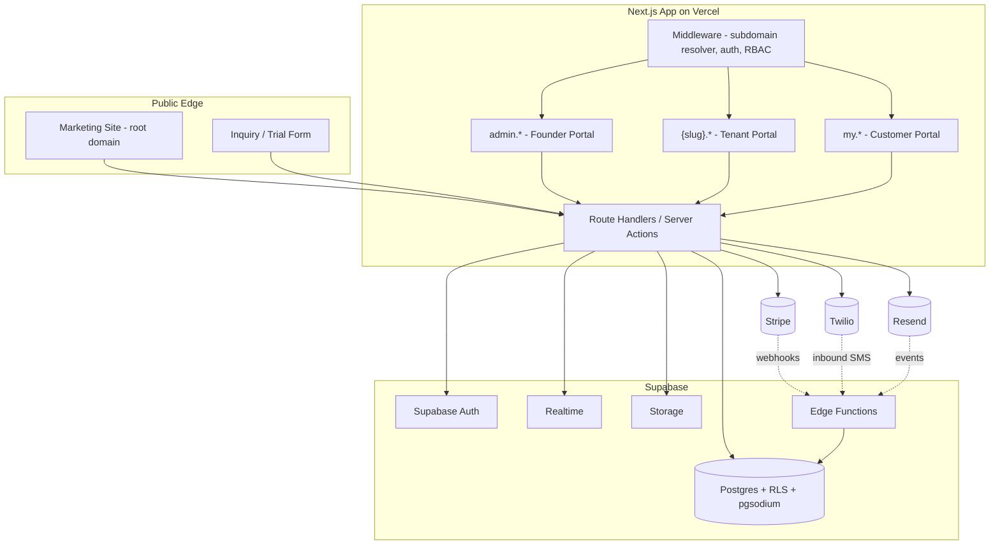
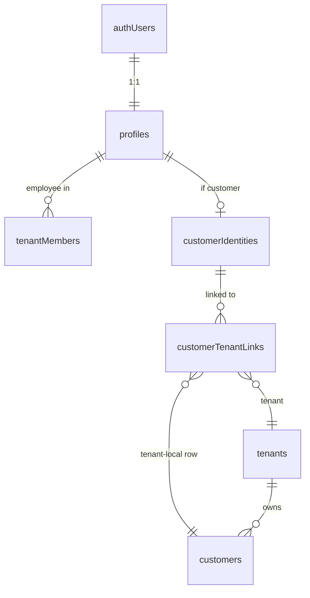
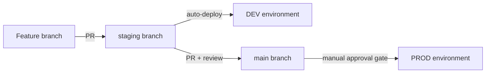
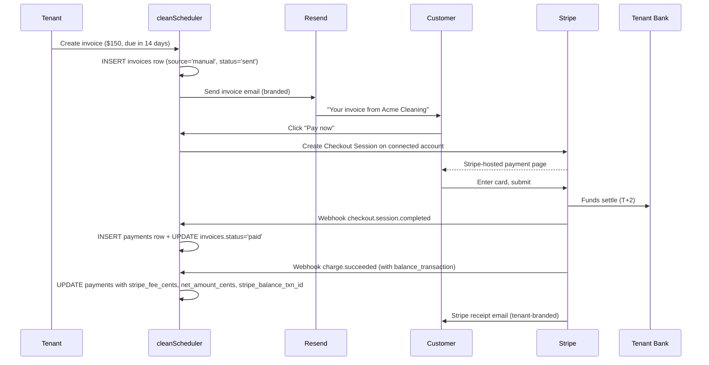
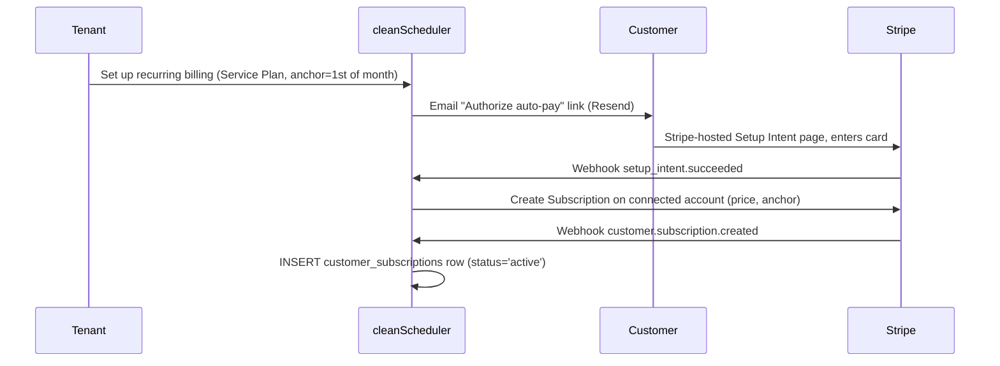
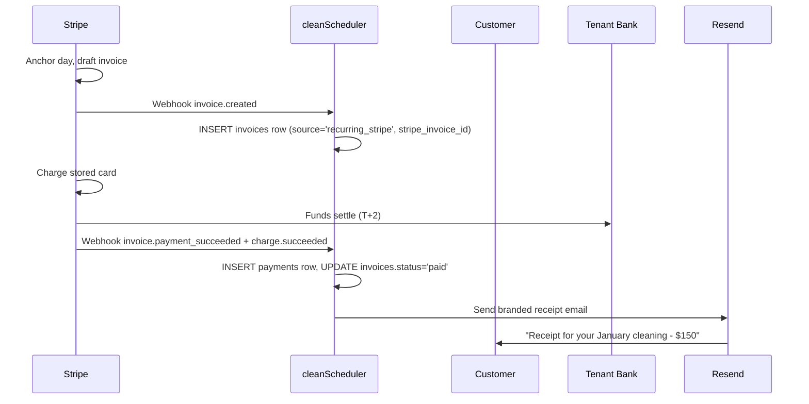

# cleanScheduler Implementation Plan

## 1. Confirmed decisions

- **Stack**: Next.js 15 (App Router, RSC) + Supabase (Postgres, Auth, Storage, Realtime, Edge Functions). Hosted on **Vercel** with wildcard domain.
- **Multi-tenancy**: shared schema, every tenant-scoped table carries `tenant_id`, isolated via Postgres RLS. JWT carries `tenant_id` and `app_role` claims.
- **Customer model**: global `customer_identities` (one Supabase Auth user) linked to per-tenant `customers` rows via `customer_tenant_links`. Customer portal aggregates across tenants.
- **Routing**: subdomain per tenant. Reserved: `www`, `app`, `admin`, `api`, `my`.
- **App boundary**: one repo, one deploy. Route groups separate marketing, founder-admin, tenant, and customer surfaces.
- **Encryption**: TLS in transit; **pgsodium** column-level encryption with per-tenant DEKs wrapped by a KEK in Supabase Vault for customer PII (phone, address, free-text notes). Stripe tokenization for payment methods. Audit-log everything for masquerade.
- **Environments**: separate **DEV** (`*.dev.cleanscheduler.com`) and **PROD** (`*.cleanscheduler.com`) all the way down — Supabase projects, Stripe accounts, Plaid keys, Twilio numbers, Resend domains, Sentry tags. Detailed in section 16.
- **Unified portal shell**: all three portals (Founder Admin / Tenant / Customer) wrap pages in a single `PortalShell` component. Pages own their content; the shell owns the chrome. Visual drift across portals is structurally impossible. Detailed in section 18 with reference mockups.
- **Styling**: **no Tailwind**. SCSS Modules (`*.module.scss`) for all component styles, with a shared design-token + mixin system (mobile-first breakpoints, light/dark via CSS custom properties). **Radix UI** primitives provide accessible behavior; we style them ourselves. Details in section 4.
- **Recommended ancillaries** (carry into plan unless you object): TypeScript end-to-end, Radix UI primitives + SCSS Modules, Redux Toolkit + RTK Query for client state (honoring your preference), React Hook Form + Zod, TanStack Table, dnd-kit (Quotes Kanban), FullCalendar (Schedule), Lucide icons, Stripe, Twilio (SMS), Resend (transactional + early campaigns), Vitest + Playwright, stylelint.

## 2. High-level architecture



## 3. Repo structure

```
/app
  /(marketing)/...        public site, inquiry form, trial signup
  /(admin)/...            founder admin (admin.cleanscheduler.com)
  /(tenant)/...           tenant portal ({slug}.cleanscheduler.com)
  /(customer)/...         customer portal (my.cleanscheduler.com)
  /api/                   route handlers (webhooks, internal RPC)
/middleware.ts            subdomain resolver + auth gate
/lib
  /supabase/              server + browser clients, typed
  /db/                    sql migrations, types, query helpers
  /auth/                  session, RBAC helpers
  /stripe/                checkout, webhooks
  /twilio/                send/receive SMS
  /resend/                send transactional email
/supabase/migrations      versioned SQL migrations
/supabase/functions       edge functions for webhooks
/components
  /ui/                    Radix-wrapped accessible primitives (Dialog, DropdownMenu, Tabs, ...)
  /layout/                Stack, Cluster, Grid, Container, Sidebar
  /feature/...            feature components, each with sibling *.module.scss
/styles
  /tokens                 _colors, _spacing, _typography, _radii, _shadows, _z, _motion
  /mixins                 _breakpoints, _focus, _a11y, _container-queries
  _index.scss             re-exports for `@use` consumers
  _globals.scss           modern-normalize + body/form resets
  _theme.scss             :root tokens + [data-theme="dark"] overrides
```

## 4. Styling & UI approach (no Tailwind)

- **SCSS Modules**: every component owns a `Component.tsx` + `Component.module.scss`. Class names are auto-scoped, so we never have to invent BEM prefixes or worry about collisions.
- **Headless behavior via Radix UI**: `@radix-ui/react-*` packages handle a11y, focus management, keyboard, and ARIA for Dialog, DropdownMenu, Popover, Tabs, Tooltip, Switch, Accordion, Toast, Select, Combobox, etc. We style them through their data attributes (`[data-state="open"]`, `[data-disabled]`, `[data-side="top"]`).
- **Design tokens** live in `styles/tokens/` and are consumed via `@use 'styles' as *;` at the top of each module. Color tokens are exposed as CSS custom properties so `data-theme="dark"` can flip the entire palette without recompilation.
- **Breakpoints** (mobile-first):

  ```scss
  $breakpoints: (
    'sm': 480px,
    'md': 768px,
    'lg': 1024px,
    'xl': 1280px,
    '2xl': 1536px,
  );

  @mixin from($name) {
    @media (min-width: map.get($breakpoints, $name)) {
      @content;
    }
  }
  ```

  Used as `@include from('md') { ... }`. **Container queries** are used inside complex components (kanban cards, calendar event chips) so they respond to their own width, not the viewport.

- **Theming**: `:root` carries the light palette as CSS custom properties; `[data-theme="dark"]` re-declares them. The initial theme is resolved by an inline pre-hydration script that prefers an explicit user choice in `localStorage`, falling back to `window.matchMedia('(prefers-color-scheme: dark)')`. The Settings toggle persists to `localStorage` + `profiles.theme_preference`. See section 4.1 for the actual color values, role aliases, and a11y guidance.
- **Layout primitives** (`components/layout/`): `Stack` (vertical rhythm), `Cluster` (wrapping inline items), `Grid` (responsive columns), `Container` (max-widths + gutter), `Sidebar` (responsive split). Feature code composes these instead of writing raw flex/grid every time, which is the main thing that keeps SCSS files small and semantic.
- **Icons**: Lucide React.
- **Forms**: React Hook Form + Zod, rendered through our own `Field`, `Input`, `Select`, `Textarea`, `Checkbox` SCSS-styled components built on Radix primitives.
- **Tables**: TanStack Table (headless) styled via SCSS Modules.
- **Drag & drop / Calendar**: dnd-kit and FullCalendar — both ship plain CSS that integrates cleanly with our token system (we override their CSS variables where they expose them).
- **Resets**: `modern-normalize` + a small `_globals.scss` for body defaults and form-element normalization.
- **Lint**: stylelint with `stylelint-config-standard-scss` + `stylelint-order` to enforce declaration order, ban `!important`, and forbid hard-coded colors outside the token files.
- **Example**:

  ```scss
  @use 'styles' as *;

  .card {
    display: grid;
    gap: spacing(3);
    padding: spacing(4);
    border-radius: radius(md);
    background: var(--color-surface);
    color: var(--color-fg);
    box-shadow: shadow(sm);

    @include from('md') {
      padding: spacing(6);
      grid-template-columns: 1fr auto;
    }
  }
  ```

## 4.1 Color system

### Brand palette (provided)

**Light mode**

- `Primary Teal` `#006D77` — main brand, logo "S"/"C"
- `Accent Glow` `#00E6D9` — sparkle trail, highlights
- `Text` `#00353A` — dark teal body text
- `Secondary Text` `#2C7A7A` — subtitles, supporting copy
- `Background` `#FFFFFF` — page background
- `Soft Background` `#F0FAF9` — cards / subtle sections
- `Sparkle Core` `#FFFFFF` — bright shine

**Dark mode**

- `Primary Teal` `#00B5A8` — main brand, slightly brighter for dark bg
- `Accent Glow` `#00F5E9` — sparkle trail, keeps pop
- `Text` `#E0F5F3` — light teal-white body text
- `Secondary Text` `#A1E4DB` — supporting copy
- `Background` `#0A1F1F` — deep dark teal-black page
- `Card / Surface` `#132E2E` — slightly lighter surfaces
- `Sparkle Core` `#FFFFFF` — bright highlights

### Role aliases (the names code references)

Code never references brand color names directly — it references roles like `var(--color-primary)`. The mapping below shows the resolved hex per theme. Roles marked **derived** were filled in to harmonize with the teal palette and are open for your review.

| Role                                    | Light                    | Dark                  | Source                                      |
| --------------------------------------- | ------------------------ | --------------------- | ------------------------------------------- |
| `bg`                                    | `#FFFFFF`                | `#0A1F1F`             | provided                                    |
| `surface`                               | `#F0FAF9`                | `#132E2E`             | provided                                    |
| `surface-raised` (popovers, dropdowns)  | `#FFFFFF`                | `#1A3838`             | derived                                     |
| `surface-sunken` (table headers, wells) | `#E4F4F2`                | `#0F2727`             | derived                                     |
| `fg`                                    | `#00353A`                | `#E0F5F3`             | provided                                    |
| `fg-muted`                              | `#2C7A7A`                | `#A1E4DB`             | provided                                    |
| `fg-subtle` (placeholders, captions)    | `#5A9494`                | `#6FB4AC`             | derived                                     |
| `fg-on-primary`                         | `#FFFFFF`                | `#0A1F1F`             | derived                                     |
| `border`                                | `#D6E2E1`                | `#244141`             | derived (neutral gray with faint teal cast) |
| `border-strong`                         | `#B5C8C6`                | `#355555`             | derived                                     |
| `primary`                               | `#006D77`                | `#00B5A8`             | provided                                    |
| `primary-hover`                         | `#005761`                | `#00D4C5`             | derived                                     |
| `primary-active`                        | `#004248`                | `#00F5E9`             | derived                                     |
| `accent`                                | `#00E6D9`                | `#00F5E9`             | provided                                    |
| `accent-hover`                          | `#00CCC0`                | `#6CFFF5`             | derived                                     |
| `focus-ring`                            | `#00E6D9`                | `#00F5E9`             | derived (accent glow doubles as focus ring) |
| `sparkle`                               | `#FFFFFF`                | `#FFFFFF`             | provided                                    |
| `success`                               | `#16A34A`                | `#22C55E`             | derived                                     |
| `success-bg`                            | `#DCFCE7`                | `#052E16`             | derived                                     |
| `warning`                               | `#D97706`                | `#F59E0B`             | derived                                     |
| `warning-bg`                            | `#FEF3C7`                | `#422006`             | derived                                     |
| `danger`                                | `#DC2626`                | `#F87171`             | derived                                     |
| `danger-bg`                             | `#FEE2E2`                | `#450A0A`             | derived                                     |
| `info`                                  | `#0891B2`                | `#22D3EE`             | derived                                     |
| `info-bg`                               | `#CFFAFE`                | `#0C2434`             | derived                                     |
| `overlay` (modal scrim)                 | `rgba(10, 31, 31, 0.55)` | `rgba(0, 0, 0, 0.65)` | derived                                     |
| `brand`                                 | alias of `primary`       | alias of `primary`    | derived (per-tenant override hook)          |

### SCSS shape

`[styles/tokens/_colors.scss](styles/tokens/_colors.scss)` exports two SCSS maps (`$colors-light`, `$colors-dark`); `[styles/_theme.scss](styles/_theme.scss)` emits them as CSS custom properties:

```scss
@use 'tokens/colors' as *;

:root {
  @each $name, $value in $colors-light {
    --color-#{$name}: #{$value};
  }
  --color-brand: var(--color-primary);
}

[data-theme='dark'] {
  @each $name, $value in $colors-dark {
    --color-#{$name}: #{$value};
  }
  --color-brand: var(--color-primary);
}
```

### Theme resolution flow

1. Inline pre-hydration script (in `<head>`, runs before paint to avoid FOUC) reads `localStorage.theme`. If set to `light` or `dark`, it sets `<html data-theme="light|dark">`. If set to `system` or absent, it reads `prefers-color-scheme` and sets `data-theme` accordingly.
2. A `system` preference also subscribes to `matchMedia` change events so the theme follows the OS until the user picks an explicit override.
3. Settings toggle offers three options: System, Light, Dark. Persists to `localStorage` and (when authenticated) syncs to `profiles.theme_preference` via a server action.
4. `<ThemeProvider>` is a tiny client component that wires the toggle handlers; the actual theme is driven by the data attribute, not React state, so SSR is FOUC-free.

### Per-tenant brand hook (reserved for later)

- `--color-brand` defaults to `var(--color-primary)`. All brand-tinted UI (CTAs, focus accents on logged-in surfaces, badges) references `var(--color-brand)`, never `--color-primary` directly.
- A future per-tenant override is implemented by setting `--color-brand` inline on `<html style="--color-brand: #xxxxxx">` from middleware (computed from `tenants.brand_color`). Phase 1 leaves `tenants.brand_color` null and the override unused — but no component refactor is needed when we light it up in Phase 2/3.

### Accessibility notes

- WCAG AA contrast targets: 4.5:1 for body text, 3:1 for large text and UI controls.
- Light-mode `fg-muted` (`#2C7A7A`) on `bg` (`#FFFFFF`) measures **~3.8:1** — comfortable for subtitles and labels but **below AA for body copy**. We'll restrict it to non-body usage (subtitles, captions, table secondary cells, form labels) and use `fg` for paragraphs. If you'd like to nudge it darker, `#1F5A5A` lifts it to ~5.0:1 while staying on-brand. Let me know if you want me to make the swap.
- All other primary fg/bg pairs in both themes pass AA cleanly. White on Primary Teal in light (`#FFFFFF` on `#006D77`) ≈ 5.6:1; dark text on Primary Teal in dark (`#0A1F1F` on `#00B5A8`) ≈ 6.7:1.
- `focus-ring` uses Accent Glow on both themes — it's distinctive and meets the 3:1 non-text contrast requirement against every surface in the system.

## 5. Routing & subdomain strategy

- Vercel wildcard domain: `*.cleanscheduler.com`.
- `[middleware.ts](middleware.ts)` parses `host`, classifies as marketing / admin / customer / tenant slug, sets a request header `x-tenant-slug`, validates session, redirects unauthenticated users.
- Tenant slug -> tenant id resolved once via cached query; mismatched session vs slug -> 403.
- Founder admin lives at `admin.cleanscheduler.com` and requires `app_role = 'founder'`.
- Customer portal lives at `my.cleanscheduler.com` and aggregates across tenant linkages for the signed-in customer identity.

## 6. Auth & RBAC

- Supabase Auth (email/password + magic link). One Supabase user = one global identity.
- `profiles` (1:1 with `auth.users`) stores the global identity.
- A profile can be:
  - a `tenant_member` of one or many tenants (Super Admin / Admin / Employee role per membership).
  - a `customer_identity` linked to one or many tenants via `customer_tenant_links`.
  - a `founder_admin` for the cleanScheduler app.
- Custom JWT claims (via Supabase auth hook): `current_tenant_id`, `tenant_role`, `app_role`, `masquerade_target_tenant_id`.
- Permissions matrix: `roles` (system + tenant-custom), `permissions` (enumerated keys like `quotes:read`, `billing:write`), `role_permissions` (M2M). System roles `Admin`, `Billing`, `Employee` seeded with sane defaults.
- Founder masquerade: server-issues a short-lived (default 60 min) `masquerade_session` requiring tenant Super Admin's recorded consent. Session id stamped onto every audit-log row written during the session.

## 7. Multi-tenancy & RLS

- Every tenant-scoped table has `tenant_id uuid not null` and indexes on it.
- RLS function `current_tenant_id()` reads from JWT.
- Standard policy template:
  ```sql
  using (tenant_id = current_tenant_id())
  with check (tenant_id = current_tenant_id())
  ```
- Founder bypass: policies allow when `auth.jwt() ->> 'app_role' = 'founder'` (read-mostly except during a valid masquerade session, which is logged).
- Customer-side policies: customers can `select` rows where `customer_id` is one of their linked rows, e.g. via a join helper `is_linked_customer(customer_id)`.

## 8. Customer-with-many-tenants model



- `customer_identities (id, primary_email, claimed_user_id)` is global.
- `customers (id, tenant_id, customer_identity_id, first_name, last_name, ...)` is per-tenant (so each tenant can keep its own notes, status, custom fields).
- `customer_tenant_links` is the join allowing a single login to see all tenant relationships.
- When a tenant invites a customer by email, we look up or create a `customer_identity`, create the per-tenant `customers` row, and email a magic-link invite. The customer claims (`claimed_user_id`) on first sign-in.

## 9. Encryption strategy

- pgsodium extension enabled.
- `tenant_keys (tenant_id, dek_id)` stores DEK references; KEK in Supabase Vault.
- Encrypted columns (initial set): `customers.phone_enc`, `customers.address_enc`, `customers.notes_enc`, free-text fields in `messages` and `support_tickets`.
- Decryption only via `security definer` functions invoked by RLS-checked queries.
- Quarterly key-rotation runbook documented from day one.

## 10. Integrations

- **Stripe (cleanScheduler subscription)**: products/prices per plan, Checkout for trial signup with `trial_period_days = 7`, Customer Portal for self-service. Webhook -> Edge Function -> updates `tenants.status` and `tenant_subscriptions`. On `customer.subscription.created` we cross-reference inquiry email to mark `inquiries.status = 'converted'`.
- **Stripe Connect (tenant -> customer payments)**: each tenant connects their own Stripe account (Standard or Express) so they can collect from their customers and receive payouts directly. Powers card payments on invoices and recurring billing for end customers (Concern #3). Connected-account webhooks update `customer_subscriptions`, create `invoices`, and record `payments` automatically. Connect onboarding lives in Tenant Settings > Billing > Payment Setup and is **optional during the 7-day trial** — tenants who skip see a verbose education screen and have recurring/card features feature-gated until they complete it (see section 14, Concern #3 for the full skip flow and gated feature list).
- **Plaid (Phase 2, Zelle/ACH reconciliation)**: tenant links a business bank account via Plaid Link; we poll daily for incoming transactions, surface Zelle/ACH credits in a match-suggestion queue, and let the tenant confirm matches against open invoices (see section 14, Concern #1).
- **Twilio**: outbound SMS via Programmable Messaging; inbound webhook -> Edge Function -> stores into `messages` table. Per-tenant phone numbers assigned from Admin > Integrations.
- **Resend**: transactional email (invites, invoices, reminders, password reset). Phase 2: campaigns via Resend Broadcasts.
- **Vercel Cron**: nightly jobs for trial-expiry sweeps, recurring-appointment generation, invoice reminders (with check-hold suppression — see Concern #2), and digest emails. Supabase `pg_cron` for in-DB hygiene.

## 11. MVP cut recommendation

Note: Concerns raised by the prospective tenant (section 14) have been folded into the phasing below. Phase 1 grows by ~2 weeks vs. the original estimate to accommodate Stripe Connect, customer recurring billing, the field check-payment workflow, and the Reports module — all of which are deal-breakers for a real cleaning business.

**Phase 1 — Trial-to-Revenue (target ~8–10 weeks of build)**

- Marketing site + Inquiry form + 7-day trial signup (creates `tenant` + Super Admin + Stripe trial subscription on cleanScheduler's account).
- Tenant portal: Dashboard (basic KPIs), Customers (CRUD), Schedule (day/week views, create/edit/assign, mobile-first appointment detail), Quotes (fixed 4-column Kanban with drag-and-drop), Billing (invoices + Stripe payments + multi-method recording), Employees (CRUD + 3 system roles), Settings (Personal, Business Info, Billing, **Payment Setup via Stripe Connect**, **Service Plans**).
- **Stripe Connect** tenant onboarding so tenants can collect from their own customers (cards + recurring). **Optional during trial** with a verbose education + skip flow; recurring billing, card-charge actions, and pay-now invoice links are server-side gated until Connect is `complete`. Manual recording of cash/check/Zelle works without Connect.
- **Customer recurring billing (Concern #3)**: `service_plans`, `customer_subscriptions`, `recurring_appointment_rules`, RRULE-based recurring appointment generator.
- **Field Accept Payment flow (Concern #2)**: mobile-first capture of cash / check (with check number, amount, optional photo). `received_in_field` -> office workflow `received_in_office` -> `deposited` -> `cleared`.
- **Manual Zelle recording (Concern #1)**: "Record Zelle payment" form with confirmation number, optional screenshot upload, and notes. Plaid auto-reconcile arrives in Phase 2.
- **Reminder cron with check holds (Concern #2)**: tenant-configurable hold days per check status; reminders suppressed during holds.
- **Reports module v1 (Concern #4)**: Invoice Audit, Payment Reconciliation, Outstanding Balances (aging), Field Check Tracking, Revenue by Service / Customer, basic Employee Performance & Compensation. CSV + PDF export.
- Customer portal: Dashboard, Schedule (read + reschedule-request), Billing (view + pay outstanding), Messages (basic 1:1), Settings.
- Founder admin: Dashboard (key metrics), Inquiries (list + filters + manual status), Customers/Tenants (list + detail + manual onboard), Settings (skeleton), basic masquerade with audit log.
- Foundation: subdomain routing, Supabase Auth, RLS everywhere, pgsodium for encrypted columns, Stripe + Stripe Connect + webhooks, **Resend** transactional email.
- **Pricing & gating infrastructure (section 15)**: `plans` + `plan_features` + `tenant_addons` + `tenant_usage_snapshots` schema seeded with the three strawman plans (Starter / Pro / Business) at placeholder prices; server-side `requireFeature` + `checkLimit` utilities; soft-stop `UpgradeOrAddOnModal` UI with the 80%/95%/100% utilization warnings; nightly usage-rollup cron. Final tier prices remain TBD until the pre-launch pricing review — flipping prices is a one-line data change.

**Phase 2 — Comms, Reconciliation & Ops**

- **Plaid integration (Concern #1)**: tenant bank linking, daily transaction sync, Zelle/ACH match-suggestion queue with one-click confirmation.
- **Advanced check workflow (Concern #2)**: per-status reminder hold overrides, bounced-check handling (auto-reopen invoice, optional bounce fee), bulk deposit slip view.
- **Reports module v2 (Concern #4)**: tips per appointment, commission rules per role, payroll exports (ADP / Gusto / QBO formats), Sales Tax Summary by jurisdiction.
- Twilio SMS in/out + Integrations admin assignments.
- Customer Service ticketing (admin) + threaded support.
- Customizable Quotes Kanban (rename, reorder, hide columns).
- Custom roles UI in tenant Settings.
- Trello-style schedule filters & employee-only view polish.

**Phase 3 — Growth & Polish**

- **CSV / OFX bank statement import (Concern #1 fallback)** for banks with poor Plaid coverage.
- Email Campaigns (gated by plan): builder, sends, open/click metrics.
- Founder masquerade UX polish + tenant-side consent flow + per-action audit UI.
- Customer portal multi-tenant polish (consolidated billing, switch-tenant chip).
- PWA / installable mobile experience for employees (offline-tolerant Schedule + Accept Payment).
- Year-end tax summaries (1099 inputs by customer).
- Advanced reporting (cohort analysis, customer LTV, churn).

## 11.5 Status sync & remaining backlog (2026-05-12)

This section reconciles the YAML todos at the top of this file with the current repo. **Authoritative shipped state is always git + deployed migrations** (`supabase/migrations/0001` … latest).

### What moved from “pending” to “in progress” (or completed) in this sync

| Original YAML idea                            | Repo reality                                                                                                                                                                                |
| --------------------------------------------- | ------------------------------------------------------------------------------------------------------------------------------------------------------------------------------------------- |
| `authProfilesTenants` as empty migration 0001 | **0001** ships multitenant auth tables + RLS; JWT fields are **`app_metadata` updated in app code** (onboarding, masquerade). No separate permissions catalog table yet.                    |
| `customerModel` as 0002-only                  | Customers + identities + links are in **0001** and later CRM migrations; **pgsodium** not enabled in SQL yet.                                                                               |
| `schedulingQuotes` as old table names         | **Tenant quotes** + **scheduled visits** + assignees + quote cron are shipped under **0009–0021** (not `quote_stages`).                                                                     |
| `billingPlans` as monolithic 0004             | **Partial:** `0013` + **`0023`** (Connect + payment columns + usage snapshot stub + check hold days + mirror tables). Still missing DB plan catalog / `tenant_addons` / full §17 lifecycle. |
| `messagingAuditInquiries` as 0005             | **0013** covers inquiries, audit, support threads/messages; not full “conversations” product.                                                                                               |
| `stripeWebhooks` “no idempotency”             | **0008** + `processStripeWebhookEventOnce` + route handler are shipped.                                                                                                                     |

### Prioritized next slices (execute in roughly this order for trial-to-revenue)

1. **CI (`cicdPipeline`)** — ~~Fix or pin stylelint/postcss so `lint:styles` is green; add it to Actions.~~ **Done (2026-05-12):** `lint:styles` green + CI step. Optionally add `prettier --check` after a one-time `npm run format` on the repo (large churn). Add `supabase db lint` or migration list check when CLI is available in CI.
2. **Env (`envGuardrails`)** — **Partial (2026-05-12):** prod requires `https://` Supabase URL; optional **`SUPABASE_DISALLOW_PROJECT_REF`** blocks local/dev from matching a prod project ref. Still optional: stricter URL↔project pairing without extra env (needs agreed naming convention).
3. ~~**Billing + Connect**~~ — **MVP landed 2026-05-12** (see §11.6). **0025 + app follow-up (2026-05-12):** `recurring_appointment_rules` + RRULE materializer cron; `billing_cycle_anchor` UX; Resend invoice email; Connect **Billing Portal**; refund-from-app; Connect webhook writers for **refunds / disputes / payouts** + dispute email to tenant owner; Balance Transaction **fee backfill** on invoice Checkout; cancel subscription (tenant + customer). **Next billing PRs:** Stripe Billing **`invoice.*`** sync into `tenant_invoices`; Setup Intents / saved PM UX polish.
4. **Transactional email (`transactionalEmail`)** — Extend **Resend** for invoices, auth-adjacent mail, and any new flows (see `lib/email/resend.ts`).
5. **Recurring (`recurringBilling`)** — `service_plans`, `customer_subscriptions`, RRULE generator + cron.
6. **Field + office money (`checkPaymentWorkflow`)** — Accept payment on visit detail; check state machine; Zelle manual entry already partially aligned with §14.
7. **Reports (`reportsModule`)** — Replace tenant `/reports` placeholder with v1 reports + exports.
8. **Feature gating (`featureGatingMetering`)** — `requireFeature` / `checkLimit` / usage rollup cron populating `tenant_usage_snapshots` (table exists empty).
9. **RLS tests (`rlsTestSuite`)** — pg_tap or SQL fixtures for tenant isolation + masquerade.
10. **Portal MVP gaps** — Customer reschedule request UX; founder dashboard metrics; tenant dashboard KPIs.

### Product decisions (2026-05-12)

- **Transactional email:** **Resend** for all app-sent mail (quotes, invites, future invoices). Env: `RESEND_API_KEY`, `RESEND_FROM_EMAIL` in `lib/env.ts` and `.env.example`.
- **Stripe Connect:** **Express** for tenant connected accounts.
- **PROD database:** project exists; migrations not applied yet. Use **`npm run db:prod-baseline`** to regenerate `supabase/scripts/generated/prod_baseline.sql`, then apply with `psql … -v ON_ERROR_STOP=1 -f` on an **empty** database (details in `supabase/scripts/README.md`). Prefer Supabase CLI migration tracking for ongoing deploys after the initial bootstrap.

### Questions only you can answer (no defaults assumed)

_(None open from the last round — add new rows here when tradeoffs reappear.)_

## 11.6 Billing / Stripe Connect MVP (2026-05-12)

**Shipped in this slice**

- **SQL:** `supabase/migrations/0023_tenant_billing_stripe_connect.sql` — `tenant_stripe_connect_accounts`, `tenants.stripe_connect_status` enum + sync trigger, extended `tenant_invoice_payments` (Stripe ids, `recorded_via`, fee columns), `tenant_usage_snapshots` (empty, for future cron), `tenant_operational_settings.check_reminder_hold_days`, mirror tables `tenant_stripe_refunds`, `tenant_stripe_disputes`, `tenant_stripe_payouts`.
- **`0024_service_plans_customer_subscriptions.sql`** — `service_plans`, `customer_subscriptions`, `tenant_customer_stripe_customers` + RLS (tenant members + customer read paths).
- **Connect onboarding:** `app/tenant/billing/payment-setup/` + server actions (`startStripeConnectOnboardingAction`, `refreshStripeConnectAccountAction`) using `lib/billing/stripeConnectServer.ts`.
- **Gating:** `lib/billing/requireConnect.ts`; tenant shell `ConnectStatusBanner`; invoice detail **Pay with card** Checkout when `stripe_connect_status=complete`; manual form no longer lists **Card** (server rejects card method). Same gate for **subscription Checkout** and **customer portal invoice pay**.
- **Tenant recurring:** `app/tenant/billing/service-plans/` (plan CRUD) + **Recurring billing** panel on customer detail (`createCustomerSubscriptionCheckoutSessionAction`, Checkout `mode=subscription`, `metadata.kind=tenant_customer_subscription`, optional `subscription_data.application_fee_percent` from `STRIPE_CONNECT_APPLICATION_FEE_BPS`).
- **Customer portal:** `app/customer/invoices/[id]/` (detail + **Pay balance**) + `app/customer/subscriptions/` + nav entry; `createCustomerInvoicePayCheckoutSessionAction` (origin `my`).
- **Webhooks:** `app/api/webhooks/stripe/route.ts` — `account.updated`; Connect `checkout.session.completed` for `tenant_invoice_pay` and `tenant_customer_subscription`; Connect `customer.subscription.*` when `metadata.kind=tenant_customer_subscription` → `lib/stripe/connectWebhookHandlers.ts` (`upsertCustomerSubscriptionFromStripe`).
- **Env:** optional `STRIPE_CONNECT_APPLICATION_FEE_BPS`, **`STRIPE_CONNECT_BILLING_PORTAL_CONFIGURATION_ID`**, **`CRON_SECRET`** (Vercel Cron auth for materializer) in `lib/env.ts` + `.env.example`.

**Also shipped (post-0024 slice, migration `0025` + routes)**

- **SQL (`0025_recurring_visits_invoice_refunds_stripe_mirrors.sql`):** `recurring_appointment_rules`; `tenant_scheduled_visits.recurring_rule_id` + idempotent unique slot per occurrence; **`tenant_invoice_payments.amount_cents`** signed (refund rows); `customer_subscriptions.billing_cycle_anchor`.
- **Recurring visits:** `lib/schedule/recurringVisitMaterialize.ts` + **`GET /api/cron/materialize-recurring-visits`** (Bearer `CRON_SECRET`); `vercel.json` daily schedule.
- **Tenant invoice UX:** Resend **Send invoice email**; **Refund in Stripe** per Checkout card row; query banners `?email=sent`, `?refund=ok`.
- **Subscriptions UX:** customer detail **billing day (1–28)** for monthly plans; **Open Stripe billing portal**; **Cancel at period end**; customer portal `/subscriptions` portal + cancel.
- **Webhooks (Connect):** `refund.*`, `charge.dispute.*`, `payout.*` → mirror tables + dispute email; invoice Checkout completion expands PI for **fee / net** columns.

**Still open (later billing PRs)**

- Stripe **Billing** hosted **`invoice.*`** sync into `tenant_invoices` (distinct from tenant-authored invoices today).
- Rich PDF / receipt templates and deep **Setup Intent** saved-card management beyond the Stripe-hosted portal.

## 12. Key files & code we'll author first

- `[middleware.ts](middleware.ts)` — subdomain & auth resolver.
- `[lib/supabase/server.ts](lib/supabase/server.ts)` and `[lib/supabase/browser.ts](lib/supabase/browser.ts)` — typed clients.
- `[lib/auth/rbac.ts](lib/auth/rbac.ts)` — permission key enum + `requirePermission()` server util.
- `[styles/_index.scss](styles/_index.scss)`, `[styles/_theme.scss](styles/_theme.scss)`, `[styles/tokens/_colors.scss](styles/tokens/_colors.scss)` (light/dark palettes + role aliases per section 4.1), `[styles/mixins/_breakpoints.scss](styles/mixins/_breakpoints.scss)` — SCSS foundation, design tokens, breakpoint mixins, light/dark theme variables.
- `[components/theme/ThemeProvider.tsx](components/theme/ThemeProvider.tsx)` + `[components/theme/themeScript.ts](components/theme/themeScript.ts)` — pre-hydration `data-theme` resolver, System/Light/Dark toggle, and `localStorage` + `profiles.theme_preference` sync.
- `[components/ui/Dialog/Dialog.tsx](components/ui/Dialog/Dialog.tsx)` + `[components/ui/Dialog/Dialog.module.scss](components/ui/Dialog/Dialog.module.scss)` — first Radix-backed primitive, used as the template for the rest of the `components/ui/` library.
- `[components/layout/Stack/Stack.tsx](components/layout/Stack/Stack.tsx)` (and siblings) — layout primitives that keep feature SCSS files small.
- `[components/portal/PortalShell.tsx](components/portal/PortalShell.tsx)` — the unified shell wrapping every authenticated page in all three portals (section 18). Renders env banner, TopBar, contextual banner slot, Sidebar, Container, optional bottom nav.
- `[components/layout/TopBar/TopBar.tsx](components/layout/TopBar/TopBar.tsx)`, `[components/layout/Sidebar/Sidebar.tsx](components/layout/Sidebar/Sidebar.tsx)`, `[components/layout/PageHeader/PageHeader.tsx](components/layout/PageHeader/PageHeader.tsx)`, `[components/layout/FilterBar/FilterBar.tsx](components/layout/FilterBar/FilterBar.tsx)` — chrome pieces used by `PortalShell` and shared across portals.
- `[components/ui/DataTable/DataTable.tsx](components/ui/DataTable/DataTable.tsx)`, `[components/ui/EmptyState/EmptyState.tsx](components/ui/EmptyState/EmptyState.tsx)`, `[components/ui/Skeleton/Skeleton.tsx](components/ui/Skeleton/Skeleton.tsx)`, `[components/ui/Toast/Toast.tsx](components/ui/Toast/Toast.tsx)`, `[components/ui/StatusPill/StatusPill.tsx](components/ui/StatusPill/StatusPill.tsx)`, `[components/ui/KeyValueList/KeyValueList.tsx](components/ui/KeyValueList/KeyValueList.tsx)` — finite UI primitive set per section 18.6.
- `[stylelint.config.cjs](stylelint.config.cjs)` — token-aware lint rules (forbid hard-coded colors, enforce declaration order).
- `[supabase/migrations/0001_init.sql](supabase/migrations/0001_init.sql)` — extensions (`pgsodium`, `pgcrypto`), profiles, tenants, tenant_members, roles, permissions, role_permissions.
- `[supabase/migrations/0002_customers.sql](supabase/migrations/0002_customers.sql)` — customer_identities, customers, customer_tenant_links + RLS.
- `[supabase/migrations/0003_scheduling.sql](supabase/migrations/0003_scheduling.sql)` — appointments, quote_stages, quotes.
- `[supabase/migrations/0004_billing.sql](supabase/migrations/0004_billing.sql)` — plans (NULLABLE prices), plan_features, tenant_addons, tenant_usage_snapshots, **tenant_subscriptions** (cleanScheduler's own subscription, renamed from `subscriptions`), invoices (with `source` enum + `stripe_invoice_id` + `stripe_subscription_id` per section 17), payments (with method enum incl. `card`/`cash`/`check`/`zelle`/`ach`, structured check fields per Concern #2, **and the Stripe accounting columns from section 17**: `gross_amount_cents`, `stripe_fee_cents`, `application_fee_cents`, `net_amount_cents`, `stripe_charge_id`, `stripe_balance_txn_id`, `stripe_payout_id`), **stripe_payouts**, **refunds**, **disputes**, tenant_settings (incl. `check_reminder_hold_days`), stripe_connect_accounts.
- `[supabase/migrations/0005_messaging_audit.sql](supabase/migrations/0005_messaging_audit.sql)` — conversations, messages, audit_log, masquerade_sessions, inquiries, support_tickets (Phase 2).
- `[supabase/migrations/0006_recurring_billing.sql](supabase/migrations/0006_recurring_billing.sql)` — service_plans, **customer_subscriptions**, recurring_appointment_rules (RRULE-driven appointment generator) per Concern #3.
- `[supabase/migrations/0007_bank_reconciliation.sql](supabase/migrations/0007_bank_reconciliation.sql)` — Phase 2: bank_links (Plaid items, encrypted access tokens), bank_transactions, payment_match_suggestions per Concern #1.
- `[supabase/migrations/0008_reports.sql](supabase/migrations/0008_reports.sql)` — report_runs (cached heavy report results) per Concern #4.
- `[supabase/functions/stripe-webhook/index.ts](supabase/functions/stripe-webhook/index.ts)` — Stripe event handler for cleanScheduler's own subscription events.
- `[supabase/functions/stripe-connect-webhook/index.ts](supabase/functions/stripe-connect-webhook/index.ts)` — Stripe Connect webhook handling tenant connected-account events: `invoice.paid`, `invoice.payment_failed`, `customer.subscription.*`, `account.updated` (drives the `stripe_connect_status` transitions), payout events.
- `[lib/billing/requireConnect.ts](lib/billing/requireConnect.ts)` — server-side feature-gate utility used by every Connect-dependent server action and Route Handler; returns a typed `ConnectGateResult` so UIs can render the right inline upgrade prompt.
- `[components/billing/ConnectStatusBanner.tsx](components/billing/ConnectStatusBanner.tsx)` + `[components/billing/PaymentSetupEducation.tsx](components/billing/PaymentSetupEducation.tsx)` — persistent status banner + the verbose education / skip-flow screen at Settings > Billing > Payment Setup.
- `[lib/billing/features.ts](lib/billing/features.ts)` + `[lib/billing/requireFeature.ts](lib/billing/requireFeature.ts)` + `[lib/billing/checkLimit.ts](lib/billing/checkLimit.ts)` — feature-key enum, server-side gate utility, and typed quota checker driving the soft-stop overage flow per section 15.
- `[components/billing/UpgradeOrAddOnModal.tsx](components/billing/UpgradeOrAddOnModal.tsx)` — soft-stop modal shown when a tenant trips a seat or customer ceiling, with "Upgrade tier" and "Add a seat" CTAs that resume the original action on success.
- `[supabase/functions/usage-rollup/index.ts](supabase/functions/usage-rollup/index.ts)` — nightly Vercel Cron rollup populating `tenant_usage_snapshots`.
- `[supabase/seed/plans.ts](supabase/seed/plans.ts)` — seeds the three strawman plans (Starter / Pro / Business) with placeholder prices and feature-key mappings per section 15.
- `[supabase/functions/plaid-sync/index.ts](supabase/functions/plaid-sync/index.ts)` — Phase 2 daily Plaid transactions sync + match-suggestion generator.
- `[supabase/functions/recurring-appointments/index.ts](supabase/functions/recurring-appointments/index.ts)` — Vercel Cron target that materializes upcoming appointments from RRULE rules.
- `[supabase/functions/invoice-reminders/index.ts](supabase/functions/invoice-reminders/index.ts)` — Vercel Cron target that issues reminder emails, honoring per-tenant `check_reminder_hold_days` and per-status overrides.

## 13. Risks / things to watch

- **Subdomain dev experience**: requires hosts-file or `lvh.me` for local. We'll set up a `dev.cleanscheduler.local` workflow and document it.
- **RLS pitfalls during masquerade**: founder bypass must be tightly scoped and unit-tested. Plan includes RLS test suite via `pg_tap` or SQL fixtures.
- **Customer-tenant join performance**: ensure composite indexes on `(tenant_id, customer_identity_id)` and `(customer_identity_id)`.
- **Stripe trial-to-paid mismatch**: webhook race conditions handled idempotently keyed off `event.id`.
- **Encryption + search**: encrypted phone/address can't be full-text searched; we'll add a hashed/blind-indexed lookup column for exact-match search where needed.
- **SCSS at scale**: without Tailwind's enforced consistency, drift is the main risk. Mitigations: stylelint forbids hard-coded colors/spacing outside token files; layout primitives (Stack/Cluster/Grid) absorb most flex/grid duplication; PR template includes a "no inline styles, no magic numbers" checkbox.
- **Zelle has no public API**: any "Zelle integration" we ship is bank-side inference (Plaid + memo conventions + manual entry). We will not promise tenants automatic Zelle reconciliation in marketing copy without the qualifier "via your linked bank account." Detail in section 14, Concern #1.
- **Stripe Connect onboarding friction**: tenants must complete identity verification with Stripe before they can collect cards from customers. Mitigation: Connect is optional during the 7-day trial. Tenants who skip see a verbose education screen (benefits, fees, what gets blocked, what still works) and a persistent in-app banner reminding them to complete it. Server-side feature gates protect every Connect-dependent action (recurring billing, card charges, pay-now links). Detailed skip flow in section 14, Concern #3.
- **Recurring-appointment generator drift**: RRULE materialization runs daily and can double-create or skip if the cron is delayed or retried. Mitigation: idempotency key per `(rule_id, occurrence_date)`; dry-run preview in the UI before activating a rule.
- **PDF generation cost**: server-side PDF rendering (Puppeteer/Chromium) is heavy on serverless. Mitigation: render PDFs on a queued worker, cache in Supabase Storage keyed off `report_run_id`, and let users download from the cached URL.
- **Cross-environment credential leak**: a live Stripe / Plaid / Twilio key accidentally configured in DEV would create real charges or send real SMS during testing. Mitigation: fail-fast env-mismatch assertion in `[lib/env.ts](lib/env.ts)` (PROD-shaped Supabase URL must pair with `sk_live_` Stripe and Plaid Production), persistent red "DEV ENVIRONMENT" banner across every authenticated page in DEV, and Stripe Restricted Keys with the narrowest scope necessary. Detail in section 16.

## 14. Tenant-raised concerns & resolutions

This section captures concerns raised during plan review by a prospective tenant, the status of each in the current plan, and the resolution approach. Cross-references to the migrations (section 12) and phasing (section 11) live inline.

### Concern #1 — Zelle payment reconciliation

**Honest reality check**: Zelle has **no public API for third-party platforms.** Zelle is operated by Early Warning Services and is integrated only into participating banks. There is no Stripe-equivalent Zelle API a SaaS app can call. Any "Zelle automation" must infer from bank-side transaction data, customer screenshots, or manual entry.

**Status**: Not previously addressed. **Multi-layer resolution** added across phases:

1. **Phase 1 — Manual Zelle recording**: a "Record Zelle payment" form on any open invoice captures payer name, amount, date, Zelle confirmation number, optional screenshot upload (Supabase Storage), and notes. Sets `payments.method = 'zelle'`, `payments.status = 'received'`, and writes an `audit_log` entry.
2. **Phase 1 — Memo convention**: invoice emails to customers display "If paying via Zelle, please include invoice number `INV-2026-0042` in the memo." Auto-match logic in Phase 2 keys off this.
3. **Phase 2 — Plaid auto-reconcile**: tenant links a business bank account via Plaid Link. We sync transactions daily, filter for incoming Zelle/ACH credits (Plaid surfaces `payment_channel`, counterparty, and memo), and present a **Suggested Matches queue**: each incoming transaction pre-matched to an open invoice by amount + customer-name fuzzy match + date proximity + memo invoice-number parse. One-click confirmation creates the `payment` record and links it to the originating `bank_transaction`.
4. **Phase 3 — CSV / OFX import**: as a fallback for banks Plaid doesn't cover well, tenant uploads a bank export. Same matching engine runs on the imported rows.

**What this changes**:

- `payments.method` enum now includes `zelle` and `ach`.
- Phase 2 adds `bank_links`, `bank_transactions`, `payment_match_suggestions` (`[supabase/migrations/0007_bank_reconciliation.sql](supabase/migrations/0007_bank_reconciliation.sql)`) plus the Plaid sync edge function.
- Phase 3 adds the CSV importer.

**Key honesty for tenant marketing copy**: we say "Zelle reconciliation via your linked bank account," not "Zelle integration." We can never guarantee real-time Zelle visibility because the rails don't allow it.

### Concern #2 — Check payment tracking with field workflow + reminder hold

**Status**: Not previously addressed. **Fully resolved in Phase 1**, with advanced bits in Phase 2.

**Field-side flow (Phase 1, mobile-first)**:

- On the employee's appointment detail page (already mobile-first per the original Schedule plan), an **Accept Payment** action surfaces. Method options: Cash / Check.
- Choosing Check captures: amount, check number, optional photo of the check (Supabase Storage), and stamps `received_by_user_id` from the session.
- Creates a `payments` row with `method='check'`, `status='received_in_field'`, `received_at=now()`.
- Audit-logged.

**Office-side flow (Phase 1)**:

- Billing admin has a **Field Checks Awaiting Office** queue (filtered view of `payments` where `status='received_in_field'`).
- Admin can transition: `received_in_field` -> `received_in_office` (acknowledging physical receipt) -> `deposited` -> `cleared`. Or to `bounced` from `deposited`.
- Each transition is audit-logged with `actor_user_id` and timestamp.

**Reminder-hold logic (Phase 1)**:

- New `tenant_settings.check_reminder_hold_days` (default `7`, tenant-editable) and per-status overrides (e.g., 14 days from `received_in_field`, 7 days from `received_in_office`, 3 days from `deposited`).
- The `[supabase/functions/invoice-reminders/index.ts](supabase/functions/invoice-reminders/index.ts)` cron skips any invoice whose most recent payment is a check still in a holding status, until `received_at + hold_days < now()`. This prevents nag-emailing customers about checks the office hasn't processed yet.
- If a check eventually `bounces`, the invoice auto-reopens and the cron resumes reminders the next morning.

**Field Check Tracking Report (Phase 1)**:

- Filter by status / employee / date range. Columns: customer, appointment, employee who received, check #, amount, status, days outstanding.
- Used by the billing admin to ensure every field-collected check made it back to the office for deposit. CSV + PDF export.

**Phase 2 additions**:

- Bulk deposit slip (group selected received_in_office checks into a single deposit-slip PDF for the bank).
- Bounced-check workflow with optional auto-applied bounce fee (tenant configurable).

**What this changes**:

- `payments` schema: `method`, `status`, `check_number`, `received_by_user_id`, `received_at`, `deposited_at`, `cleared_at`, `photo_url`, `bounce_reason`.
- `tenant_settings` table introduced (key-value with typed accessors) for `check_reminder_hold_days` and the per-status overrides.
- Mobile-first Accept Payment UI on the appointment detail page.
- Field Check Tracking Report in Billing > Reports.

### Concern #3 — Recurring subscription billing for end customers

**Status**: Partially covered in the original plan (the word "subscription" was in the docs but only for tenant->cleanScheduler billing). **Promoted to Phase 1** because cleaning businesses live and die by recurring revenue.

**Resolution approach**:

- **Stripe Connect** (Standard or Express): each tenant connects their own Stripe account so they can collect from customers and receive payouts directly. cleanScheduler facilitates the integration; funds flow tenant <-> customer. **Connect is optional during the trial** — see "Trial-time Connect skip flow" below.
- **Service Plans** (`service_plans`): tenant-defined templates in Settings (e.g., "Bi-weekly Standard Clean", base price, billing interval, default appointment cadence, included service items).
- **Customer enrollment** (`customer_subscriptions`): from the customer detail page, "Set up recurring billing" enrolls a customer either in a Service Plan or a custom recurrence. Backed by a Stripe Subscription on the connected account, with `billing_cycle_anchor` set so the customer is billed on a fixed day of the month/week (the prospective tenant's exact requirement).
- **Recurring appointments** (`recurring_appointment_rules`): independent of billing cadence — a customer can be billed monthly but cleaned bi-weekly. RRULE-based generator (`[supabase/functions/recurring-appointments/index.ts](supabase/functions/recurring-appointments/index.ts)`) runs daily and materializes the next N occurrences (configurable, default 60 days out) so they appear on the Schedule and can be reassigned individually.
- **Webhook integration**: `[supabase/functions/stripe-connect-webhook/index.ts](supabase/functions/stripe-connect-webhook/index.ts)` listens to the connected account's `invoice.created`, `invoice.paid`, `invoice.payment_failed`, and `customer.subscription.*` events; auto-creates `invoices` + `payments` rows mirroring Stripe.

#### Trial-time Connect skip flow + feature gating

Stripe Connect requires identity verification (legal name, EIN/SSN, bank account, sometimes a business document). That can take 5–30 minutes and isn't always something a tenant wants to do at 9 PM while exploring a new SaaS. We make Connect optional during the trial, but invest in education so tenants understand the trade-off.

**Onboarding UI**:

1. Self-serve trial signup creates the tenant + Super Admin and lands them on the Tenant Dashboard.
2. The Dashboard shows a prominent (but dismissible per session) banner: "Set up payment processing to unlock card payments and recurring billing."
3. Settings > Billing > Payment Setup is the canonical Connect entry point. Tenant can also be deep-linked there from any blocked feature.
4. The Payment Setup page presents a **two-CTA education screen**:
   - **Primary CTA**: "Set up Stripe Connect" (kicks off Stripe-hosted onboarding via `accountLinks`).
   - **Secondary CTA**: "Skip for now — I'll set this up later" (opens a confirmation dialog explaining what's about to be blocked).

**Education-screen copy** (verbose by design — captured here so we don't lose intent during build):

- **What you get by completing Stripe Connect**:
  - One-click credit card payments on every invoice (your customers click "Pay now" and you're paid in 2 business days).
  - Automated recurring billing — set a customer up once on the 1st of every month and Stripe handles the charge, the receipt, and the bookkeeping.
  - Faster cash flow vs. waiting for checks in the mail or chasing Zelle confirmations.
  - Reduced manual reconciliation work (transactions auto-flow into your Reports).
  - A professional, branded checkout experience — your customers never leave the cleanScheduler-issued invoice.

- **The fees** (Stripe takes these from each charge; cleanScheduler does not add a platform fee at launch):
  - Cards (US): 2.9% + $0.30 per successful charge.
  - ACH bank debits: 0.8% capped at $5.00 per charge.
  - International cards: additional 1.5%.
  - Currency conversion (rare for residential cleaning): 1%.
  - Payouts to your bank: free (standard 2-business-day payout).
  - cleanScheduler may add a small platform fee in the future and you'll be notified at least 30 days in advance.

- **If you skip — what still works**:
  - You can create and email invoices to customers.
  - You can manually record cash, check, and Zelle payments against any invoice.
  - You can mark checks received in the field, track them through deposit, and run the Field Check Tracking report.
  - Quotes, scheduling, employee management, and customer messaging are unaffected.

- **If you skip — what's blocked until you complete Connect**:
  - "Pay now" links on outbound invoice emails (they're hidden — customers see "Pay your cleaner directly using cash, check, or Zelle. Reach out for our payment details.").
  - "Set up recurring billing" on customer detail pages.
  - "Charge card" actions on individual invoices.
  - Customer-facing Stripe receipts and the Stripe-hosted Customer Billing Portal.

- **Reassurance**: "You can complete this any time from Settings > Billing > Payment Setup. Most tenants finish it in about 10 minutes."

**Feature gating (server-side)**:

- All Connect-dependent server actions check `tenants.stripe_connect_status === 'complete'` (a generated column over `stripe_connect_accounts`). Possible statuses: `not_started`, `in_progress`, `pending_verification`, `complete`, `restricted`.
- Gates protect:
  - `customer_subscriptions` creation / activation.
  - Stripe Charge actions on invoices.
  - Pay-now link generation in `[supabase/functions/invoice-reminders/index.ts](supabase/functions/invoice-reminders/index.ts)` and the invoice-issued email template.
  - Customer Billing Portal session creation.
- Gates do **not** protect: `service_plans` CRUD (tenant can build them anytime), `recurring_appointment_rules` (rules can exist without billing attached — Schedule still materializes the cleanings), invoice CRUD, manual payment recording (`cash`/`check`/`zelle`/`ach` manual), reports.
- Each gated UI surface shows an inline upgrade prompt: "Complete Stripe Connect to enable [feature]." with a button that deep-links to `/settings/billing/payment-setup?return_to=/customers/{id}`. After Connect completes, the user is bounced back to where they were.

**Persistent reminder banner**:

- Dismissible-per-session at the top of the Tenant Portal whenever `stripe_connect_status != 'complete'`. Copy adapts to status:
  - `not_started`: "Set up payment processing to unlock card payments and recurring billing."
  - `in_progress`: "Stripe needs a few more details to finish your payment setup. Resume now."
  - `pending_verification`: "Stripe is reviewing your account. We'll let you know within 24 hours." (No CTA.)
  - `restricted`: "Stripe needs additional information from you to keep collecting payments. Update now." (Highest urgency styling.)

**Naming clarification for the schema (rolled into the Key files list)**:

- `tenant_subscriptions` — tenant's plan with cleanScheduler (renamed from `subscriptions`).
- `customer_subscriptions` — end customer's recurring service with their tenant.

**What this changes**:

- New migration `[supabase/migrations/0006_recurring_billing.sql](supabase/migrations/0006_recurring_billing.sql)` for `service_plans`, `customer_subscriptions`, `recurring_appointment_rules`. Adds `stripe_connect_accounts` (account_id, status, charges_enabled, payouts_enabled, requirements, last_synced_at) and a `tenants.stripe_connect_status` generated column for fast gating checks.
- Stripe Connect onboarding flow in Tenant Settings > Billing > Payment Setup with the education screen + skip path described above.
- Server-side feature-gate utility: `[lib/billing/requireConnect.ts](lib/billing/requireConnect.ts)` — used by every Connect-dependent server action and Route Handler. Returns a typed `ConnectGateResult` so UIs can render the right inline prompt.
- Customer detail page gets a "Recurring billing" panel; Schedule shows generated occurrences with a small repeating-icon affordance.
- Persistent banner component (`[components/billing/ConnectStatusBanner.tsx](components/billing/ConnectStatusBanner.tsx)`) wired into the Tenant Portal layout.
- New cron + webhook edge functions called out in section 12.

### Concern #4 — Comprehensive financial audit & reporting

**Status**: Partially covered (original plan mentioned an "Accounting view" but lacked specifics). **Expanded to a dedicated Reports module**, Phase 1 baseline + Phase 2 advanced.

**Phase 1 Reports module — Tenant Billing > Reports** (date-range filters, CSV + PDF export on every report):

- **Invoice Audit Report**: every invoice in period with status (draft/sent/paid/overdue/void), due date, paid date, days outstanding, customer, total, payment method(s).
- **Payment Reconciliation Report**: every payment grouped by method (card / cash / check / Zelle / ACH), with reconciliation status (auto-matched / manually-matched / unmatched / pending). Designed for monthly bookkeeping.
- **Outstanding Balances Report**: open invoices grouped by customer with aging buckets (0–30 / 31–60 / 61–90 / 90+).
- **Field Check Tracking Report** (per Concern #2 above).
- **Revenue by Service / Customer**: groupings useful for pricing analysis and identifying top customers.
- **Employee Performance & Compensation Report (basic)**: per employee — hours worked (from appointment durations), jobs completed, gross labor cost using `employees.labor_cost_per_hour`. Designed as a payroll input the tenant exports to ADP / Gusto / QBO.

**Phase 2 Reports module — additions**:

- Tips per appointment + commission rules per role (modeled in `compensation_rules`).
- Payroll exports formatted for ADP / Gusto / QBO file specifications.
- Sales Tax Summary by jurisdiction (using customer service address).
- Operational reports: utilization by employee, on-time-arrival, customer satisfaction inputs.

**Phase 3**:

- Year-end tax summary inputs (1099-relevant totals by customer, W-2 inputs by employee).
- Cohort / LTV / churn analytics.

**Audit chain-of-custody**: the existing `audit_log` table (security audit) is extended to record every state transition on `invoices` and `payments` (status changes, edits to amount, who marked it deposited/cleared). Reports can link directly to the audit-log row that justified each entry — exactly what the tenant's accountant will want for an end-of-year audit.

**What this changes**:

- New `[supabase/migrations/0008_reports.sql](supabase/migrations/0008_reports.sql)` for `report_runs` (cached heavy report results so re-opens are instant; stale TTL configurable per report).
- PDF generation via a queued worker (Puppeteer or `pdfkit`); rendered PDFs cached in Supabase Storage keyed off `report_run_id`.
- New `compensation_rules` table arrives in Phase 2.
- Audit-log extended with structured action types for invoice/payment lifecycle events.

### Cross-cutting deltas to the original plan (summary)

These four concerns drive the following changes you'll see reflected throughout the plan:

- **Stripe Connect** added (was previously just Stripe for cleanScheduler's own subscription).
- **Plaid** added as a Phase 2 integration.
- **Naming**: `subscriptions` -> `tenant_subscriptions`; new `customer_subscriptions`.
- **New tables**: `service_plans`, `customer_subscriptions`, `recurring_appointment_rules`, `tenant_settings`, `bank_links`, `bank_transactions`, `payment_match_suggestions`, `report_runs`, `compensation_rules` (Phase 2), `stripe_connect_accounts`, plus the pricing/gating set per section 15: `plan_features`, `tenant_addons`, `tenant_usage_snapshots`.
- **Expanded `payments` schema**: method enum, status enum, structured check fields, bank-transaction match link.
- **New Reports module** under Tenant Billing.
- **Mobile-first Accept Payment** flow on Schedule appointment detail.
- **Reminder cron** with check-hold suppression.
- **Phase 1 grows ~2 weeks** (8–10 weeks vs. original 6–8) to absorb these changes — well worth it because the prospective tenant won't sign up without them.

## 15. Pricing & feature tiers (TBD pre-launch)

**Status**: Final pricing is deferred to a pre-launch pricing review. The strawman below is captured as a **working hypothesis only** so we can build the feature-gating, metering, and overage infrastructure now without committing to numbers. Changing tiers, prices, or feature placements later is a data-only change (`plans` rows + `plan_features` rows), not a code change.

### Strawman (numbers are placeholders, structure is real)

Three flat-priced tiers, monthly with optional annual prepay (default 17% off = 2 months free). 7-day free trial on all tiers. No forever-free tier at launch — revisit post-launch if organic-growth data warrants one.

**Starter — $39/mo (placeholder)** — solo operator / 2-person operation.

- Up to 3 users, up to 150 active customers.
- Core scheduling (day/week, mobile-first Accept Payment).
- Customers + Customer Portal.
- Quotes Kanban (fixed 4 columns).
- Invoicing + manual recording of cash/check/Zelle.
- Field Check Tracking + reminder holds.
- Basic Reports: Invoice Audit, Outstanding Balances, Field Check Tracking.
- System roles only (Admin / Billing / Employee).
- Email transactional only (invoices, reminders).
- Email support, ~24h response.

**Pro — $89/mo (placeholder)** — established 2–10 person company. The tier we steer most signups toward.

- Everything in Starter, plus:
- Up to 10 users, up to 750 active customers.
- **Customer recurring billing** (`service_plans` + `customer_subscriptions`).
- **Recurring appointment rules** (RRULE-driven).
- **Customizable Quotes Kanban** (Phase 2 feature; this gate becomes meaningful when that ships).
- **Custom roles + permissions matrix** (Phase 2 feature, same).
- **Advanced Reports**: Payment Reconciliation, Revenue by Service/Customer, basic Employee Performance & Compensation.
- **Twilio SMS outbound** (Phase 2 feature; first 250 segments/mo included, then $0.04/segment).
- Branded email sender (verified domain).
- Priority email support, ~8h response.

**Business — $199/mo (placeholder)** — 10–30 person operations, commercial / multi-location.

- Everything in Pro, plus:
- Up to 30 users, **unlimited active customers**.
- **Email Campaigns** (Phase 3 feature).
- **Plaid bank reconciliation** (Phase 2 feature; Concern #1).
- **Payroll-ready exports** (ADP / Gusto / QBO formats; Phase 2).
- **Sales Tax Summary** by jurisdiction (Phase 2).
- **Twilio SMS inbound + outbound** (first 1,500 segments/mo included).
- Founder-level audit log export.
- Phone + priority email support, ~4h response, dedicated success contact.

### Table-stakes features (every tier, never gated)

- Mobile-friendly Schedule + Accept Payment.
- Manual recording of cash/check/Zelle.
- Stripe Connect onboarding (the tenant's own decision; Stripe's standard processing fees apply, cleanScheduler adds nothing at launch).
- Customer Portal access.
- 2FA, audit log, RLS isolation, pgsodium encryption.
- Light/dark mode + a11y compliance.

### Overage policy — soft-stop with upsell

When a tenant hits a seat or customer ceiling, we **don't break their day**. Instead:

- The triggering action (e.g., "Invite Employee", "Add Customer") opens a non-blocking modal:
  - **Primary CTA**: "Upgrade to [next tier]" — opens a comparison + upgrade flow that resumes the original action on success.
  - **Secondary CTA**: "Add 1 seat for $9/mo" (or "Add 100 customers for $5/mo", parameterized per resource) — provisions a Stripe subscription item add-on against the tenant's current subscription and increments the effective limit.
- Inline warning banners at 80% / 95% / 100% utilization keep tenants informed before they hit the wall.
- A daily `tenant_usage_snapshots` rollup feeds:
  - the founder admin's "expansion candidates" dashboard,
  - the tenant's "You're at 145 of 150 customers" warnings,
  - end-of-period usage reconciliation against `tenant_addons`.

### Gating + metering infrastructure (built in Phase 1, prices TBD)

Even with TBD prices, we build all of this now so launch-day pricing is a config change, not a refactor.

**Schema (lands in `[supabase/migrations/0004_billing.sql](supabase/migrations/0004_billing.sql)`)**

- `plans (id, slug, name, monthly_cents NULLABLE, annual_cents NULLABLE, included_users, included_customers, included_sms_segments, ...)`. Nullable numeric limits = unlimited. `monthly_cents`/`annual_cents` nullable so we can ship the schema before final prices are decided.
- `plan_features (plan_id, feature_key)` — many-to-many linking plans to a feature-key enum.
- `tenant_addons (id, tenant_id, addon_type, quantity, unit_price_cents, stripe_subscription_item_id, status)` — one row per active add-on.
- `tenant_usage_snapshots (tenant_id, snapshot_date, active_users, active_customers, sms_segments_used, ...)` — daily rollup.

**Code**

- `[lib/billing/features.ts](lib/billing/features.ts)` — feature-key enum, the source of truth for what's gateable. Strawman keys: `recurring_billing`, `kanban_customization`, `custom_roles`, `email_campaigns`, `plaid_reconciliation`, `payroll_exports`, `sales_tax_summary`, `sms_outbound`, `sms_inbound`, `branded_email`, `phone_support`.
- `[lib/billing/requireFeature.ts](lib/billing/requireFeature.ts)` — server-side gate utility, mirrors `requireConnect.ts`. Every gated server action calls `await requireFeature(tenantId, 'recurring_billing')` and gets a typed `FeatureGateResult` so UIs can render either the feature or an upsell prompt.
- `[lib/billing/checkLimit.ts](lib/billing/checkLimit.ts)` — quota checker that enforces seat/customer ceilings and returns a typed `LimitCheckResult` driving the soft-stop modal.
- `[supabase/functions/usage-rollup/index.ts](supabase/functions/usage-rollup/index.ts)` — Vercel Cron target running nightly to populate `tenant_usage_snapshots`.

**Seeding**

`[supabase/seed/plans.ts](supabase/seed/plans.ts)` seeds the three strawman plans with placeholder prices (`null` allowed). Final prices are populated via a one-line migration during the pre-launch pricing review.

### Decisions deferred to pre-launch pricing review

- Final price points per tier (Starter / Pro / Business).
- Annual discount percentage (default 17%).
- Whether to introduce a forever-free Solo tier (1 user / 25 customers / manual-only) after we see early adoption metrics.
- Per-resource add-on pricing ($9/seat strawman, $5/100-customer strawman).
- Volume discounts for multi-location / franchise tenants.
- Founder-level launch promo codes (e.g., "FOUNDING50" — 50% off year one for first 100 tenants).
- Marketing-page tier comparison copy & "most popular" badge placement.

## 16. Environments (DEV / PROD) & deployment

**Goal**: separate DEV and PROD all the way down the stack so you and your client can demo, test, and break things in DEV without touching real money or production data, then onboard fresh in PROD when they're ready to handle live business.

### Environment matrix

| Concern                   | Local (engineer)                             | DEV (client testing)                                | PROD (live)                                                |
| ------------------------- | -------------------------------------------- | --------------------------------------------------- | ---------------------------------------------------------- |
| Domain                    | `*.lvh.me:3000`                              | `*.dev.cleanscheduler.com`                          | `*.cleanscheduler.com`                                     |
| Founder admin             | `admin.lvh.me:3000`                          | `admin.dev.cleanscheduler.com`                      | `admin.cleanscheduler.com`                                 |
| Customer portal           | `my.lvh.me:3000`                             | `my.dev.cleanscheduler.com`                         | `my.cleanscheduler.com`                                    |
| Next.js host              | `next dev`                                   | Vercel (DEV deployment)                             | Vercel (Production deployment)                             |
| Database                  | Local Supabase via `supabase start` (Docker) | Dedicated Supabase project (Free tier OK initially) | Dedicated Supabase project (**Pro** tier for PITR backups) |
| Auth / Storage / Edge Fns | Local Supabase                               | DEV Supabase                                        | PROD Supabase                                              |
| Stripe                    | Test mode                                    | Test mode                                           | Live mode                                                  |
| Stripe Connect            | Test connected accounts                      | Test connected accounts                             | Live connected accounts                                    |
| Plaid (Phase 2)           | Sandbox                                      | Sandbox                                             | Production                                                 |
| Twilio (Phase 2)          | Test creds + Magic numbers                   | Real creds against trial number                     | Verified production phone numbers                          |
| Resend                    | Skipped or `cleanscheduler.test`             | Verified `dev.cleanscheduler.com`                   | Verified `cleanscheduler.com`                              |
| Sentry                    | Disabled or local-only                       | DEV environment tag                                 | PROD environment tag                                       |
| Vercel Cron               | Manual triggers only                         | Lower cadence                                       | Production cadence                                         |

### DNS & subdomain plan

Cloudflare (or Vercel-managed) DNS for `cleanscheduler.com`:

- `A` / `CNAME` for root + `www` -> Vercel.
- `*` (wildcard) -> Vercel for tenant subdomains (`acme.cleanscheduler.com`).
- `dev` -> Vercel for the DEV deployment landing page.
- `*.dev` -> Vercel for DEV tenant subdomains (`acme.dev.cleanscheduler.com`).
- Reserved subdomains (rejected at signup): `www`, `app`, `admin`, `api`, `my`, `dev`, `staging`, `preview`.
- `MX` + `TXT` (SPF / DKIM / DMARC) for Resend, separate records per environment because we use different `From:` domains.

The Vercel project has both apex domains attached: `cleanscheduler.com` + `*.cleanscheduler.com` + `dev.cleanscheduler.com` + `*.dev.cleanscheduler.com`. Wildcard SSL is auto-managed.

### Branching, deploys, CI/CD



- **Branches**: `main` = PROD; `staging` = DEV; feature branches -> PR into `staging`.
- **GitHub Actions on every PR**: typecheck, ESLint, stylelint, Vitest unit tests, `supabase db diff` to verify migrations are consistent with the linked schema, `pg_tap` RLS tests against an ephemeral local Supabase.
- **Vercel auto-deploys**:
  - PRs -> Vercel Preview (frontend only, points at the DEV Supabase, with a "Preview build" banner).
  - `staging` merge -> DEV deployment + `supabase db push` to the DEV project (auto).
  - `main` merge -> PROD deployment + `supabase db push` to the PROD project, **gated by a manual approval step** in GitHub Actions before any DDL touches PROD.
- **Rollback**: Vercel one-click frontend rollback. PROD migration rollbacks are **forward-only** via fix-up migrations (no `db reset` in PROD, ever). Runbook lives at `[docs/runbooks/db-rollback.md](docs/runbooks/db-rollback.md)`.

### Secrets & env vars

- **Vercel** env vars scoped per env: `Development` (preview & dev-branch), `Preview`, `Production`.
- **Supabase** secrets live per project; Edge Functions read via `Deno.env`.
- **Local**: `.env.local` (gitignored), seeded from a checked-in `.env.example` listing every required key with empty values.
- Required keys per env (typed by `[lib/env.ts](lib/env.ts)` via a Zod schema, fail-fast on boot if anything is missing or malformed):
  - `NEXT_PUBLIC_SUPABASE_URL`, `NEXT_PUBLIC_SUPABASE_ANON_KEY`, `SUPABASE_SERVICE_ROLE_KEY`.
  - `STRIPE_SECRET_KEY`, `STRIPE_WEBHOOK_SECRET`, `STRIPE_CONNECT_CLIENT_ID`, `STRIPE_CONNECT_WEBHOOK_SECRET`.
  - `PLAID_CLIENT_ID`, `PLAID_SECRET`, `PLAID_ENV` (Phase 2).
  - `TWILIO_ACCOUNT_SID`, `TWILIO_AUTH_TOKEN`, `TWILIO_FROM_NUMBER` (Phase 2 SMS).
  - `RESEND_API_KEY`, `RESEND_FROM_EMAIL` (transactional email — Resend).
  - `SENTRY_DSN`, `SENTRY_ENVIRONMENT`.
  - `APP_ENV` (`local` / `dev` / `prod`) — drives the env-mismatch assertion below.

### Env-mismatch guardrails (hard rules)

- **Fail-fast assert** on app boot in `[lib/env.ts](lib/env.ts)`:
  - If `APP_ENV === 'prod'`, then `STRIPE_SECRET_KEY` must start with `sk_live_`, `PLAID_ENV` must equal `production`, and `NEXT_PUBLIC_SUPABASE_URL` must match the recorded PROD project ref.
  - If `APP_ENV !== 'prod'`, then `STRIPE_SECRET_KEY` must start with `sk_test_` and `PLAID_ENV` must be `sandbox` or `development`.
  - Mismatch -> the app refuses to start and logs a loud error.
- **Persistent red "DEV ENVIRONMENT — no real charges" banner** at the top of every authenticated page in DEV (and a yellow "Local" variant locally). Implemented as a server component reading `APP_ENV`.
- **Stripe Restricted Keys**: PROD service-role keys scoped to the minimum (no key with full `customers:write` lying around in CI logs).
- **No PROD database access from local dev**: PROD Supabase project disallows new IP allowlist entries by policy; only Vercel egress IPs and the founder's audited bastion address can reach it.

### Data isolation rules

- DEV and PROD never share a database, an auth pool, a storage bucket, a Stripe account, or a Twilio number.
- DEV uses Stripe Test mode + Plaid Sandbox + Twilio test credentials; PROD uses live for all three.
- DEV may be wiped at any time. PROD never gets `db reset`.
- No production data flows to DEV automatically. (Phase 2 introduces an opt-in sanitized weekly refresh that runs through pgsodium-decrypt-then-scrub before insert; Phase 1 keeps DEV seeded only from `[supabase/seed/dev.sql](supabase/seed/dev.sql)`.)

### Promotion strategy: DEV -> PROD

Your client's path from "evaluating in DEV" to "live in PROD" is **a fresh signup in PROD**, not a data migration. This is intentional:

- DEV data accumulates noise (test customers, half-baked invoices, broken state from feature branches).
- Re-creating a clean record set in PROD is the safest first day of live business.
- For tenants that have done meaningful piloting in DEV and built up legitimate data, a "white-glove migration" runbook (`[docs/runbooks/dev-to-prod-migration.md](docs/runbooks/dev-to-prod-migration.md)`) covers a manual `pg_dump` of the relevant tables, sanity-check, sanitization, and restore to PROD with new IDs. **Not a self-service feature.**

### Local development experience

- `pnpm dev` uses `lvh.me:3000` for subdomain testing — no `/etc/hosts` edits required (`*.lvh.me` resolves to `127.0.0.1` from public DNS).
- `supabase start` boots a local Supabase stack (Postgres, Auth, Storage, Studio at `localhost:54323`).
- `pnpm db:reset` runs `supabase db reset`, which wipes and reapplies all migrations + the dev seed (`supabase/seed/dev.sql`: 2 demo tenants, 5 demo customers each, sample invoices/payments/appointments, a few open quotes). The dev seed never runs in DEV or PROD.
- `pnpm test:e2e` runs Playwright against the local stack with deterministic fixtures.

### Cost summary (baseline, monthly USD)

- **DEV**: Supabase Free ($0) + Vercel Hobby ($0) + Stripe test ($0) + Plaid Sandbox ($0) + Twilio trial ($0) + Resend Free ($0) ≈ **$0** until DEV outgrows Free tier (then $25/mo for Supabase Pro).
- **PROD**: Supabase Pro ($25) + Vercel Pro ($20) + Stripe (per-charge, no monthly) + Plaid Production (~$0.30/successful sync, Phase 2) + Twilio (~$0.008/SMS segment, Phase 2) + Resend ($20 above 3k/mo) + Sentry Team ($26) ≈ **$90–110 baseline + variable usage**.

### Phase rollout for the env work

- **Pre-Phase 1 (week 0)**: provision DEV Supabase project, configure DNS for `dev.cleanscheduler.com`, set up Vercel project with both env scopes, GitHub Actions skeleton (lint + typecheck only), local dev working with `lvh.me`.
- **Phase 1 mid-build**: provision PROD Supabase + PROD Stripe live mode + PROD domain DNS once we have something demo-able. Manual deploy gate to PROD on `main` merges. Founder-only access to PROD admin until launch. Add the env-mismatch fail-fast assertion.
- **Phase 1 launch week**: open the gates — public marketing on `cleanscheduler.com`, real trial signups in PROD.
- **Phase 2**: enable Supabase Branching for per-PR ephemeral databases (Pro tier feature, makes preview deploys properly DB-isolated).
- **Phase 2**: weekly sanitized PROD -> DEV refresh job, gated behind a founder-only "Refresh DEV from PROD" button.

## 17. Payment processing & accounting (tenant <-> customer)

This section explains exactly how a customer's credit card payment flows from card swipe to the tenant's bank account, how cleanScheduler stays aware of every cent for accounting purposes, and how refunds, disputes, and recurring payments fit in.

### 17.1 Stripe Connect model

- **Account type**: Stripe Connect **Express**. Tenants get a streamlined Stripe-hosted onboarding (legal name, bank account, identity verification) and an Express Dashboard for their own visibility, but most day-to-day work happens inside cleanScheduler.
- **Charge type**: **Direct charges**. Each customer payment is processed against the tenant's connected account, not against the cleanScheduler platform balance. The tenant is the **merchant of record** — their business name appears on the customer's card statement, they own dispute relationships, they pay Stripe processing fees out of the gross.
- **Application fee**: **`application_fee_amount = 0`** at launch. The schema column (`payments.application_fee_cents`) exists so a future "platform fee" lever is one config change away (decision deferred to the section 15 pre-launch pricing review). Until then, every cent the customer pays beyond Stripe's processing fee goes to the tenant.
- **PCI scope**: cleanScheduler stays at **SAQ-A** — the lightest PCI level — because cards are entered exclusively into Stripe-hosted pages. We never see card numbers, CVCs, or full expirations.
- **Money flow we never touch**: customer card -> Stripe -> tenant's connected balance -> tenant's bank (per Stripe payout schedule, default T+2). cleanScheduler is not in the funds path.

### 17.2 One-off invoice payment flow



- **Source of truth for one-off invoices**: cleanScheduler's `invoices` table. Stripe just processes the payment; we never create a Stripe Invoice for one-offs.
- **The "Pay now" link** is generated on demand: every click creates a fresh Stripe Checkout Session against the tenant's connected account, so we never ship stale URLs.
- **Branding**: Resend sends the invoice email with cleanScheduler / tenant branding; Stripe's auto-receipt carries the tenant's name (because direct charges).

### 17.3 Recurring payment flow

Two distinct sub-flows: a one-time setup to capture a card on file, then Stripe runs the rest on autopilot.

**Setup (one-time per customer)**



**Autopilot (every billing interval, forever)**



- **Source of truth for recurring invoices**: Stripe creates them; we mirror via webhook into our `invoices` table with `source='recurring_stripe'` and `stripe_invoice_id` populated. Stripe owns retries, dunning logic, and card-update flows.
- **Stripe-issued emails are disabled** for connected-account subscriptions (`auto_advance: true`, `collection_method: 'charge_automatically'`, no email send). All customer-facing email comes from cleanScheduler via Resend so the experience stays consistently branded.
- **Card updates**: customer can update payment method any time via a generated **Stripe Customer Billing Portal** session — we deep-link into it from the customer portal so they never see Stripe's bare-metal UI raw; they enter via our app.
- **Failed payments**: `invoice.payment_failed` webhook -> we mark invoice past-due, notify the tenant, Stripe's smart retries kick in (default 3 retries over 3 weeks; configurable on the connected account).

### 17.4 The unified accounting data model

Every payment of every kind lives in a single `payments` table. Columns added specifically for Stripe accounting (the ones that let the tenant's accountant reconcile to the bank statement):

```
payments
─────────
  id
  invoice_id              → joins to invoices.source (manual | recurring_stripe | quote_converted)
  customer_id
  tenant_id
  method                  → card | cash | check | zelle | ach
  status                  → received | succeeded | failed | refunded | disputed
  gross_amount_cents      → what the customer paid
  stripe_fee_cents        ← from Stripe balance_transaction
  application_fee_cents   ← always 0 at launch (architected for future, see 17.1)
  net_amount_cents        ← gross − stripe_fee − application_fee
  currency
  stripe_charge_id              ← canonical charge id on the connected account
  stripe_balance_txn_id         ← canonical Stripe accounting record id
  stripe_payout_id              ← which payout batch this rolled into (NULL until payout)
  received_at
  ...check-specific fields per Concern #2...
```

Sister tables capture the rest of the accounting picture:

- **`stripe_payouts`** `(id, tenant_id, stripe_payout_id, arrival_date, amount_cents, status)` — every batched bank deposit. Tracked via `payout.created` and `payout.paid` webhooks. When a payout closes, we backfill `payments.stripe_payout_id` for every charge in that batch — that's what powers "Payments in this payout" reconciliation.
- **`refunds`** `(id, payment_id, amount_cents, reason, stripe_refund_id, created_at, created_by)` — partial or full refunds. Tenant initiates from cleanScheduler (we call Stripe API on the connected account) or from their Stripe Express Dashboard (we hear about it via `charge.refunded` webhook either way).
- **`disputes`** `(id, payment_id, stripe_dispute_id, amount_cents, reason, status, evidence_due_by, outcome, resolved_at)` — chargebacks. We notify the tenant; they respond from their Express Dashboard (Stripe owns the evidence-submission UI; we don't rebuild it). We track the lifecycle via `charge.dispute.created`, `charge.dispute.updated`, `charge.dispute.closed`.

### 17.5 Webhook map (connected-account `[supabase/functions/stripe-connect-webhook/index.ts](supabase/functions/stripe-connect-webhook/index.ts)`)

Idempotent against `event.id`. Every event also writes an `audit_log` row.

| Event                           | What we do                                                                                        |
| ------------------------------- | ------------------------------------------------------------------------------------------------- |
| `account.updated`               | Recompute `stripe_connect_status` (drives feature gates per section 14, Concern #3)               |
| `setup_intent.succeeded`        | Stash payment-method id; signal "card on file" so the activate-subscription button enables        |
| `customer.subscription.created` | INSERT `customer_subscriptions` with anchor + interval                                            |
| `customer.subscription.updated` | Update status / anchor / price                                                                    |
| `customer.subscription.deleted` | Mark `status='cancelled'`, optionally end recurring appointments                                  |
| `invoice.created`               | INSERT mirrored `invoices` row (source='recurring_stripe')                                        |
| `invoice.payment_succeeded`     | Mark invoice paid; INSERT pre-fee `payments` row                                                  |
| `invoice.payment_failed`        | Mark invoice past-due; notify tenant; let Stripe retry                                            |
| `checkout.session.completed`    | Tie one-off Checkout payment to the originating invoice                                           |
| `charge.succeeded`              | Backfill `stripe_fee_cents`, `net_amount_cents`, `stripe_balance_txn_id` from balance_transaction |
| `charge.refunded`               | INSERT `refunds` row; update `payments.status='refunded'`; reopen invoice if full refund          |
| `charge.dispute.created`        | INSERT `disputes` row; notify tenant; deep-link to Express Dashboard                              |
| `charge.dispute.closed`         | Update dispute outcome; if lost, mark payment `disputed` and reopen invoice                       |
| `payout.created`                | INSERT `stripe_payouts` row (status='in_transit')                                                 |
| `payout.paid`                   | Update payout status; backfill `payments.stripe_payout_id` for each charge in the batch           |
| `payout.failed`                 | Update payout status; notify tenant; Stripe will retry                                            |

### 17.6 Money-flow timing the tenant cares about

A concrete example for the tenant's accountant:

- Three customers each pay a $150 invoice on Monday morning.
- Stripe immediately holds each $150 in the tenant's connected balance, deducts $4.65 (`2.9% + $0.30`) per charge as the processing fee. Net per charge: $145.35.
- On Wednesday (T+2 standard payout schedule), Stripe deposits the day's net into the tenant's bank account as a single line item.
- Tenant's bank statement shows "STRIPE TRANSFER $436.05" on Wednesday.
- Tenant opens cleanScheduler > Billing > Reports > **Payment Reconciliation** filtered to that payout date and sees:

```
Payout STR_xxx — arrived 2026-01-21 — $436.05
  Customer A  Invoice INV-0042  $150.00 gross  −$4.65 fee  = $145.35 net
  Customer B  Invoice INV-0043  $150.00 gross  −$4.65 fee  = $145.35 net
  Customer C  Invoice INV-0044  $150.00 gross  −$4.65 fee  = $145.35 net
                                                          ──────────
                                              Net to bank  $436.05
```

Bank statement matches the report to the penny. That is the entire job of section 17.

### 17.7 Reporting integration (with section 14, Concern #4)

The Reports module already specced in section 14 picks up these accounting columns automatically:

- **Payment Reconciliation Report** — group rows by `stripe_payout_id` to produce the table above; group by `method` for the broader cash/check/Zelle/card breakdown.
- **Invoice Audit Report** — exposes `invoices.source` so manual vs recurring is obvious at a glance.
- **Outstanding Balances** — counts past-due recurring invoices alongside manual ones (no special casing needed).
- **Year-end totals (Phase 3)** — `SUM(stripe_fee_cents)` per year is the deductible processing-fee total; `SUM(gross_amount_cents)` is gross revenue per customer for 1099 thresholds; `SUM(application_fee_cents)` is always 0 today but ready for the day we flip it on.

### 17.8 Refunds & disputes — the ugly side

- **Refund (from cleanScheduler)**: tenant clicks "Refund" on a payment row. Optional partial amount + reason + internal note. We call `refunds.create` on the connected account. Webhook returns. We INSERT into `refunds`, update `payments.status`, adjust the related invoice balance, and (if full) reopen the invoice for re-billing if needed. Customer's card is credited within 5–10 business days (Stripe's clock).
- **Refund (from Stripe Dashboard)**: same data lands via `charge.refunded` webhook with `created_by` left null (we don't know which Stripe user clicked it). UI flags those rows with an "originated outside cleanScheduler" badge so the audit trail stays honest.
- **Dispute / chargeback**: `charge.dispute.created` -> we notify the tenant by email + in-app banner ("$150 chargeback received — respond by Feb 14"). Stripe withholds the disputed amount from the tenant's balance immediately. Tenant submits evidence from their Express Dashboard (Stripe's UI, not ours). When `charge.dispute.closed` fires, we update outcome and any balance impact.

### 17.9 What we DON'T do (intentionally, captured so we don't drift later)

- **We never store card numbers, CVCs, or full expirations.** Customers always type those into Stripe-hosted pages. PCI scope = SAQ-A.
- **We don't move money ourselves.** Money flow is tenant-bank ↔ Stripe ↔ customer-card. cleanScheduler never holds funds in any custodial sense.
- **We don't issue Stripe receipts.** Stripe does, branded as the tenant. We supplement with Resend emails for invoices, reminders, and our own receipts where they add value.
- **We don't manage payout scheduling.** Default T+2; tenants can change it in their Stripe Express Dashboard. We surface the current schedule on the Payment Setup screen as info.
- **We don't rebuild Stripe's Disputes UI.** We deep-link tenants into their Express Dashboard for evidence submission.

## 18. Portal shell, layout & UI primitives

The three portals (Founder Admin, Tenant, Customer) share a single **`PortalShell`** component. Visual drift across portals is structurally impossible because every page renders inside the same shell — only the navigation contents and a small role chip differ.

### 18.1 Why a unified shell

- One shell component, three portals: anything that changes the chrome changes everywhere.
- One token file (section 4.1): hex values outside the tokens fail stylelint.
- A small, finite set of UI primitives (section 18.5): engineers compose, not invent. New page = arrange existing pieces.
- Same `PortalShell` props on all three portals: PR reviews feel identical regardless of which portal they touch.

### 18.2 Shell composition

`[components/layout/PortalShell.tsx](components/layout/PortalShell.tsx)` is parameterized by:

- `navItems: { icon, label, href }[]` — primary nav rendered in the sidebar.
- `identityChip: ReactNode` — small label below the user avatar (e.g., "Founder", "Tenant: Acme Cleaning", "Switch tenant ▾").
- `bottomNav?: { icon, label, href }[]` — optional 4-item bottom nav for mobile (used on customer portal + employee view of tenant portal).

The shell renders, in order:

1. **Env banner** — DEV only, full-width red strip from section 16. Hidden in PROD.
2. **TopBar** — 64px desktop / 56px mobile. Left: collapse-sidebar toggle (mobile-only), brand mark + product name. Center: global search input (cmd-K opens an action palette in Phase 2). Right: theme toggle, notifications bell with unread count, user-menu avatar with profile / sign-out / help.
3. **Contextual banner slot** — non-environmental status: Stripe Connect setup pending (section 14, Concern #3), trial countdown ("3 days left in your trial"), dispute alerts, payment-method-expiring warnings. Banners stack vertically, dismissible per-session where appropriate.
4. **Sidebar** — 240px desktop, collapsible to 56px icon-rail (state persisted per user); becomes a drawer at `< md`. Identity chip and tenant slug at the bottom.
5. **Main content area** — pages own this; always wrapped in a `Container` (max-width 1280px, padding 24px desktop / 16px mobile).
6. **Bottom nav** (mobile only, when configured) — 4 most-used destinations.

### 18.3 Desktop wireframe

```
┌─────────────────────────────────────────────────────────────────────────────┐
│ DEV ENVIRONMENT — no real charges                                           │  env banner (DEV only)
├─────────────────────────────────────────────────────────────────────────────┤
│  [logo]  cleanScheduler        [global search]              [🌗] [🔔] [👤]  │  TopBar (64px)
├──────────────┬──────────────────────────────────────────────────────────────┤
│              │  Connect setup pending — finish in 10 minutes  [Set up >]    │  contextual banner
│  • Dashboard │  ────────────────────────────────────────────────────────    │
│  • Quotes    │                                                              │
│  • Customers │  ┌───────────────────────────────────────────────────────┐   │
│  • Schedule  │  │  Customers                                            │   │  PageHeader
│  • Employees │  │  Manage your customer roster      [+ Add customer]    │   │
│  • Billing   │  └───────────────────────────────────────────────────────┘   │
│  • Settings  │                                                              │
│              │  [All]  [Active]  [Past due]                  [🔍 Search]    │  FilterBar
│              │  ───────────────────────────────────────────────────────     │
│   240px      │                                                              │
│  Sidebar     │  ┌───────────────────────────────────────────────────────┐   │
│              │  │                                                       │   │
│              │  │  Main content (cards / tables / forms / kanban)       │   │
│              │  │                                                       │   │
│              │  └───────────────────────────────────────────────────────┘   │
│              │                                                              │
│  ─────────   │                                       [Page 1 of 12  < >]   │
│  [Avatar]    │                                                              │
│  Jane Doe    │                                                              │
│  Acme Clean  │                                                              │
└──────────────┴──────────────────────────────────────────────────────────────┘
```

### 18.4 Mobile wireframe

```
┌────────────────────────────────────┐
│ DEV — no real charges              │  env banner (collapsed)
├────────────────────────────────────┤
│ [☰] cleanScheduler        [🔔][👤] │  56px header
├────────────────────────────────────┤
│  Connect pending  [Set up >]       │  contextual banner
│  ─────────────────                 │
│                                    │
│  Customers                         │
│  Manage your customer roster       │
│                  [+ Add customer]  │  primary action stacks
│                                    │
│  [All] [Active] [Past due]         │  filter bar wraps
│  [🔍 Search]                       │
│  ─────────────                     │
│                                    │
│  ┌──────────────────────────────┐  │
│  │ Card                         │  │
│  └──────────────────────────────┘  │
│                                    │
│  ┌──────────────────────────────┐  │
│  │ Card                         │  │  cards stack 1-up on mobile
│  └──────────────────────────────┘  │
│                                    │
├────────────────────────────────────┤
│  [🏠]  [📅]  [💬]  [👤]            │  optional bottom nav
└────────────────────────────────────┘
```

### 18.5 Per-portal navigation

The shell is identical across all three portals. The only differences are the sidebar items and the identity chip.

- **Founder Admin** (`admin.cleanscheduler.com`): Dashboard / Inquiries / Customers (= tenants) / Integrations / Customer Service / Accounting / Settings. Identity chip: `[Founder]` badge.
- **Tenant Portal** (`{slug}.cleanscheduler.com`): Dashboard / Quotes / Customers / Schedule / Employees / Email Campaign (plan-gated, hidden if not in plan) / Billing / Settings. Identity chip: `[Tenant: Acme Cleaning]`.
- **Customer Portal** (`my.cleanscheduler.com`): Dashboard / Schedule / Billing / Messages / Settings. Identity chip: `[Switch tenant ▾]` only when linked to multiple tenants.

### 18.6 UI primitives engineers compose from (no invention)

Every page is built by arranging these. New patterns require explicit approval (added to this list, then implemented in the shared primitive library).

- **`PageHeader`** — H1 + description + actions slot (right-aligned). Always present, always 88px desktop / 72px mobile.
- **`FilterBar`** — Radix Tabs for primary filters + search input + Radix DropdownMenu for advanced filters + density toggle. Always immediately under PageHeader.
- **`DataTable`** — TanStack Table with sticky header row, sticky first column on horizontal scroll, no zebra (cleaner against soft surface), row hover using `--color-surface-sunken`, right-aligned numerics, pagination at the bottom.
- **`Card`** — same padding/radius/shadow tokens everywhere; clickable cards lift on hover.
- **`Form`** — labels above inputs, 13px helper text, inline errors in `--color-danger`, primary action right-aligned, secondary action to its left, `Esc` cancels, `Enter` submits where unambiguous.
- **`EmptyState`** — fixed layout: 64px Lucide icon + H3 + description + CTA. No clip-art mascots.
- **`Skeleton`** — pulsing skeleton matching content shape. We never spinner in main content; spinners are reserved for sub-second inline operations.
- **`Toast`** — top-right, slide-in, auto-dismiss after 5 seconds, optional action ("Undo"). Stack max 3.
- **`StatusPill`** — single component for invoice statuses, payment statuses, dispute statuses, etc. Color-coded against the token system.
- **`KeyValueList`** — used on detail pages for "Phone:", "Address:", etc. Aligns labels in a grid so detail pages always read the same.

### 18.7 Density & responsiveness

- Three density modes: `Comfortable` (default), `Compact` (denser tables for power users), `Cozy` (touch-friendly). Toggleable from the user menu, persisted to `profiles.density_preference`.
- Breakpoints from section 4: `sm 480 / md 768 / lg 1024 / xl 1280 / 2xl 1536`.
- Sidebar: persistent at `xl+`, collapsed icon-rail at `lg`, drawer at `< md`.
- Tables go horizontally scrollable at `< lg` rather than reflowing into cards — preserves data density on iPads, which cleaning-business owners commonly use in the field.

### 18.8 Reference mockups

High-fidelity reference mockups for the unified shell baseline plus a sample populated page from each portal live alongside this plan in:

- `[docs/design/portal-mockups/01-shell-baseline.png](docs/design/portal-mockups/01-shell-baseline.png)` — the structural shell with neutral content.
- `[docs/design/portal-mockups/02-tenant-schedule.png](docs/design/portal-mockups/02-tenant-schedule.png)` — Tenant Portal, Schedule day view with appointments.
- `[docs/design/portal-mockups/03-admin-dashboard.png](docs/design/portal-mockups/03-admin-dashboard.png)` — Founder Admin Portal, Dashboard with key metrics.
- `[docs/design/portal-mockups/04-customer-dashboard.png](docs/design/portal-mockups/04-customer-dashboard.png)` — Customer Portal, Dashboard with upcoming appointment and outstanding invoice.

Mockups are reference only; real implementation may iterate within the constraints of the token system (section 4.1) and the primitive library (section 18.6).

## 19. Out-of-scope until you say otherwise

- Native mobile (React Native).
- Full email-campaigns builder.
- Multi-currency / international.
- White-label per-tenant theming beyond logo + name.
- Tenant-level data export portability (compliance feature for later).
